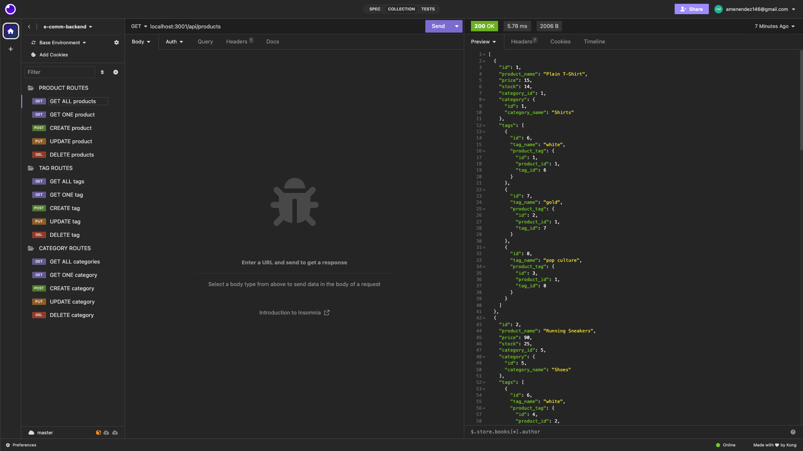

# E-Commerce Backend

This project aims to serve as a backend for an E-Commerce website with the ability to search all, search for one, create, update, and delete categories, products, and tags used by users to shop on a website. The ability to search all and search for a specific category, product, and tag enables the user to find items on a website that matches what they're looking for and trying to purchase. The ability to create, update, and delete future proofs the website to allow the company to dynamically add, update, and delete products as new products are released, old products are phased out, or update things like stock and price as they change.

This project focused on creating a database using MySql but through the Sequelize framework which makes MySql easier to use. Creating models and associations between different tables was definitely a signifcant chunk of the project. Lastly, making routes to make all the features possible was definitely the area I had to troubleshoot the most as I realized after testing that I didn't really have a confirmation to the user that something was created, updated, or deleted. Overall, it was cool to see how I could create a product with JSON and then could search for that product i created with my other routes as well as update and delete that product. 

*Some starter code provided by EdX*

## Usage
[Demo Video](https://drive.google.com/file/d/1GFjLdfLerdW2_LBzYYeRplc9QmUQRFwz/view)
 
 

## Code Source
[Repository](https://github.com/alexismenendez/amenendez-e-commerce-backend)

## Resources & Assets
[dotenv](https://www.npmjs.com/package/dotenv) 
[express](https://www.npmjs.com/package/express) 
[sequelize](https://www.npmjs.com/package/sequelize) 
[mysql2](https://www.npmjs.com/package/mysql2)